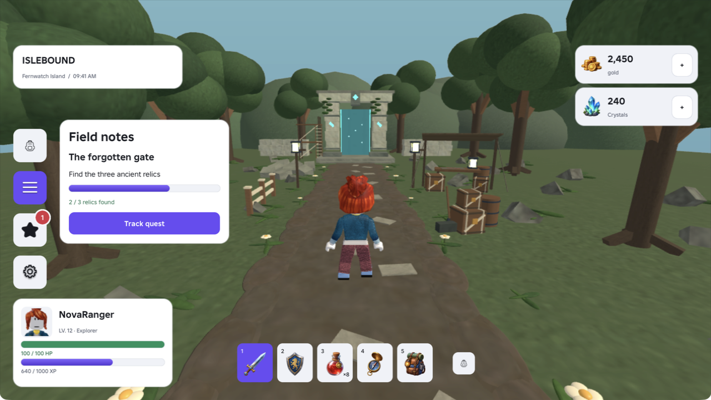
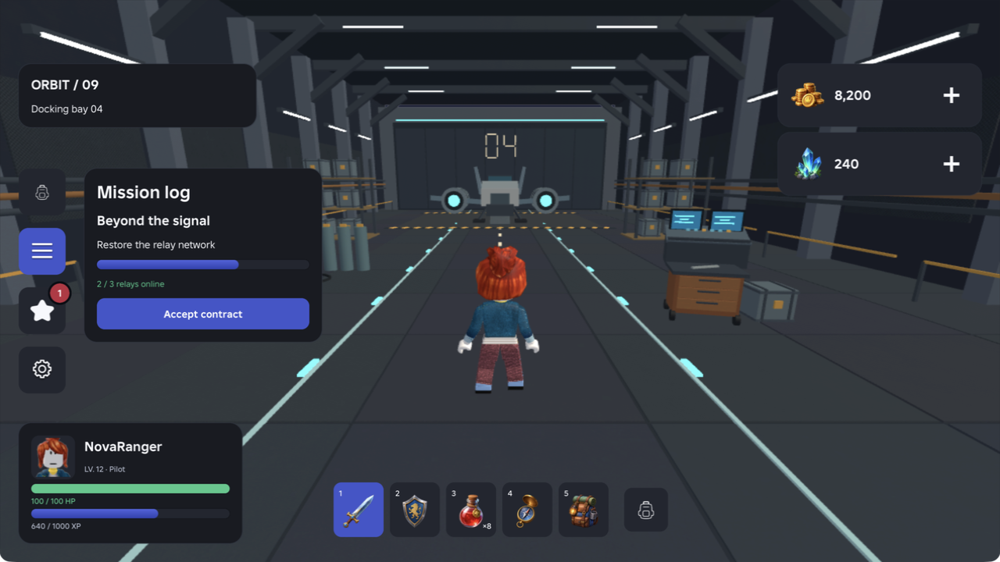
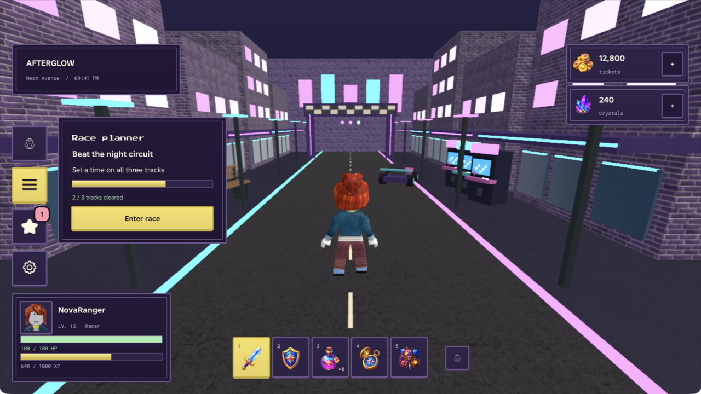
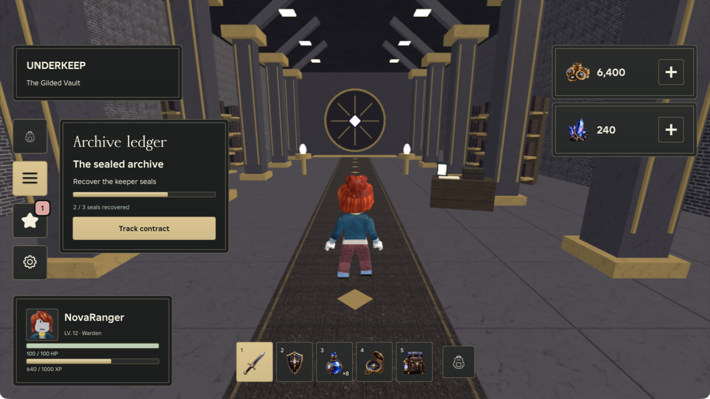
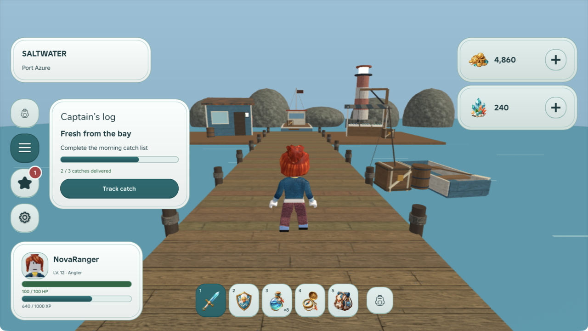
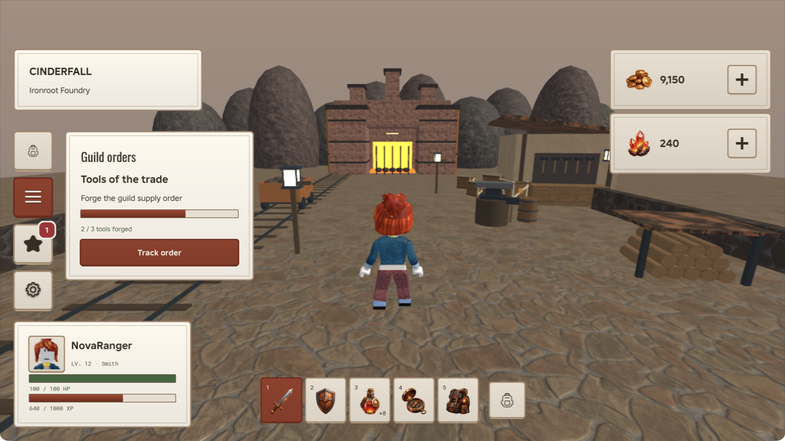
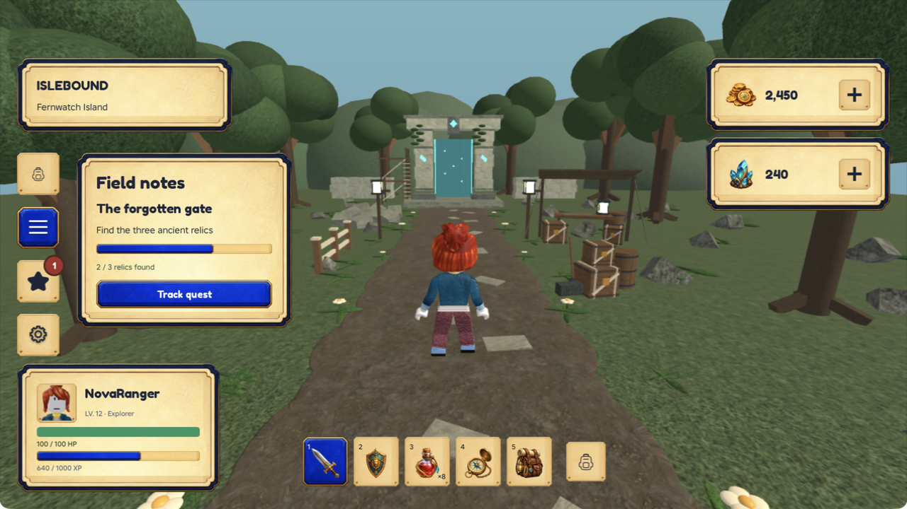
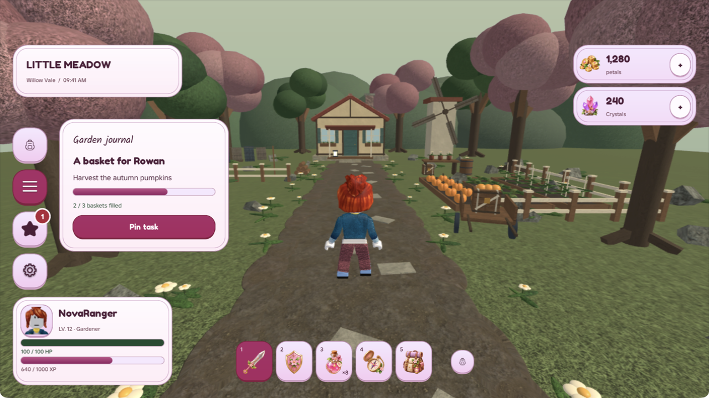
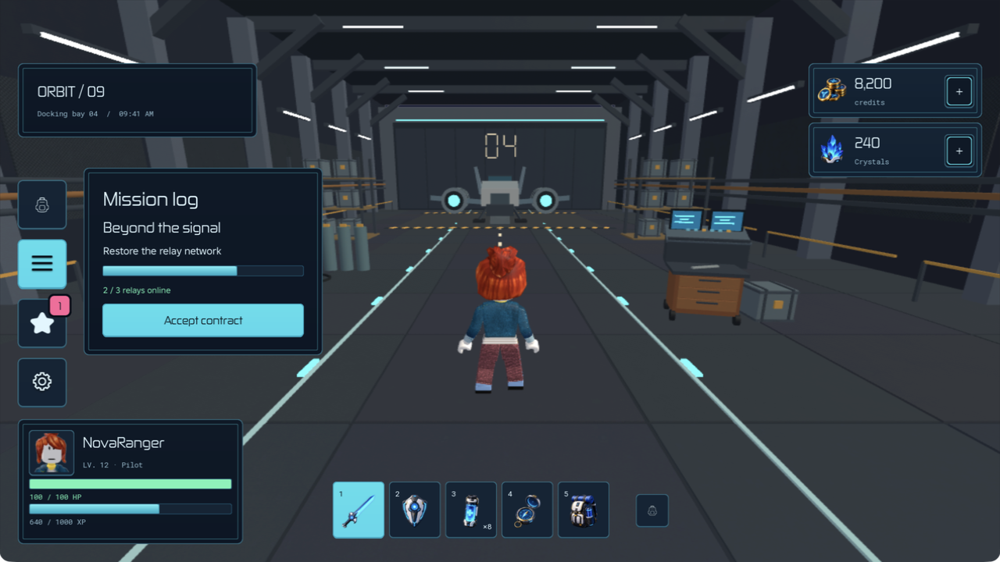
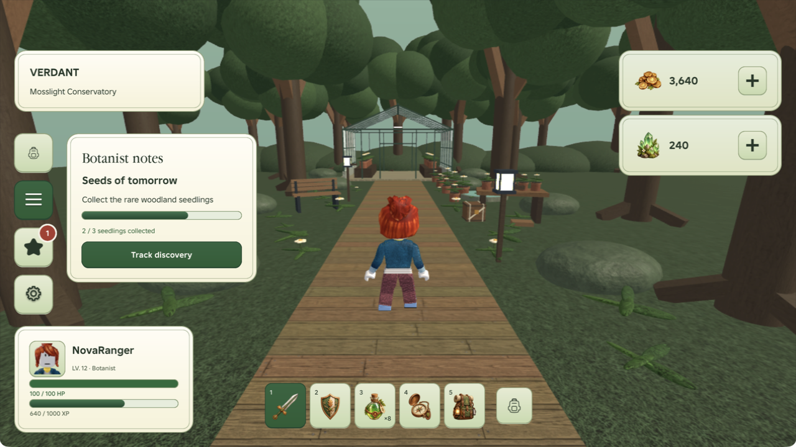

# oof/ui

**Roblox controls, styled as a system.**

Twenty React-Luau primitives, native Roblox input, and one shared theme contract.
Core includes Default and Light under MIT. Override colors, typography, spacing,
and materials without replacing your game’s controls.



| Default · free | Light · free |
| --- | --- |
|  |  |

## Build with your agent

The free oofui project skill helps your agent find components, read their APIs,
and compose native Roblox UI. `oofui init` installs it automatically.
[Read the agent skill guide](https://oofui.bytespell.com/#/docs/agents).

## Add it to your game

The CLI adds editable source, resolves dependencies, connects Rojo, and installs
an agent skill. Node 22.12+, Wally and Rojo are required:

```sh
npm install -g https://oofui.bytespell.com/downloads/oofui-0.1.0.tgz
mkdir my-game
cd my-game
oofui init
oofui component add progressbar
oofui add button container
oofui build
oofui studio open
```

The [docs site](https://oofui.bytespell.com/#/docs/installation) hosts the audited CLI
and free source ZIPs. To build the CLI from this checkout, use `npm install -g ./cli`.
Npm registry publication is optional and remains pending; use the site URL above.
`oofui init` preserves an existing Rojo game's mappings and installs the project
skill at `.agents/skills/oofui`. Ask your agent: "Use $oofui to add a player UI."
Read the [skill](skills/oofui/SKILL.md) for the complete workflow.

Use `oofui list`, `oofui docs progressbar`, `oofui view progressbar`, and
`oofui info --json` to discover APIs and inspect the project. Use `--dry-run`
before applying a change. Local modifications are protected by content hashes.

Free files go in `vendor/oofui`. Purchased themes and Pro Plus kits are fetched
from authenticated store endpoints into ignored `.oofui/private`, and mounted
by Rojo alongside Core. Their code and original art are absent from this source
tree and the CLI package. An installed item name does not grant access.

Mount the provider inside the ScreenGui it styles:

```luau
local ReplicatedStorage = game:GetService("ReplicatedStorage")
local React = require(ReplicatedStorage.Packages.React)
local ReactRoblox = require(ReplicatedStorage.Packages.ReactRoblox)
local Ui = require(ReplicatedStorage.OofUi)

local theme = Ui.styles.createTheme({
    theme = Ui.styles.themes.light,
    overrides = { CnColorAccent = Color3.fromRGB(84, 116, 255) },
})
local sheet = Ui.styles.createStyleSheet(theme)
local screen = Instance.new("ScreenGui")
screen.ResetOnSpawn = false
screen.Parent = game:GetService("Players").LocalPlayer:WaitForChild("PlayerGui")
local root = ReactRoblox.createRoot(screen)
root:render(React.createElement(Ui.styles.StyleProvider, {
    styleSheet = sheet,
}, {
    Continue = React.createElement(Ui.Button, {
        text = "Continue",
        onActivated = function() print("Ready to play") end,
    }),
}))
-- On permanent removal: root:unmount(); sheet:Destroy(); theme:Destroy(); screen:Destroy()
```

The public Wally release `bytespell/oof-ui-primitives@0.1.0` is being prepared.
Until published, use the CLI above.

## Explore the example

Install [Rokit](https://github.com/rojo-rbx/rokit) and a current Roblox Studio:

```sh
rokit install
wally install
rojo build showcase.project.json -o build/showcase.rbxlx
```

Open that place once in Studio and press Play. One selector pairs Default with
the outpost and Light with the island. Pin a quest, claim a daily reward, and
toggle the demonstration setting; theme/world changes preserve control state. The worlds are deterministic, with a fixed third-person preview camera;
the images here are native Studio captures. The example has no game backend.
Close the example Studio window when finished.

## The components

Button, IconButton, Container, Text, ProgressBar, RadialProgress, HoldButton,
TextField, Dialog, Checkbox, Switch, RadioGroup, RadioGroupItem, Separator,
Field, FieldContent, FieldLabel, FieldDescription, FieldError, and FieldGroup.

Button, IconButton, and HoldButton accept `badge = true` for an unread dot or
`badge = 12` for a count. Zero clears it. Counts cap at `99+` by default;
`badgeMax` changes the limit. The badge inherits the theme and native UIScale.

## The Pro collection

| Arcade · Pro | Obsidian · Pro |
| --- | --- |
|  |  |

| Tide · Pro | Ember · Pro |
| --- | --- |
|  |  |

Adventure, Bloom, Circuit, Grove, Arcade, Obsidian, Tide, and Ember are offered separately as one editable
theme pack. They use the same components and theme contract. Their source is
not part of Core. The collection is being prepared for sale.

| Adventure | Bloom |
| --- | --- |
|  |  |

| Circuit | Grove |
| --- | --- |
|  |  |

Core source is [MIT licensed](LICENSE). Pro preview images illustrate the
separately licensed theme collection; this export does not grant its source.

## Contributing to Core and the CLI

Edit native implementations in `src/`, then run `npm test`. Its pretest refreshes
the CLI's free registry from the approved Wally source list. For a new component
or dependency, update the item metadata and bundle file list in `cli/registry`.
`npm run build:registry` refreshes source hashes without fetching paid content.
The CI uses the pinned Rokit tools and checks the actual installed Rojo tree.
