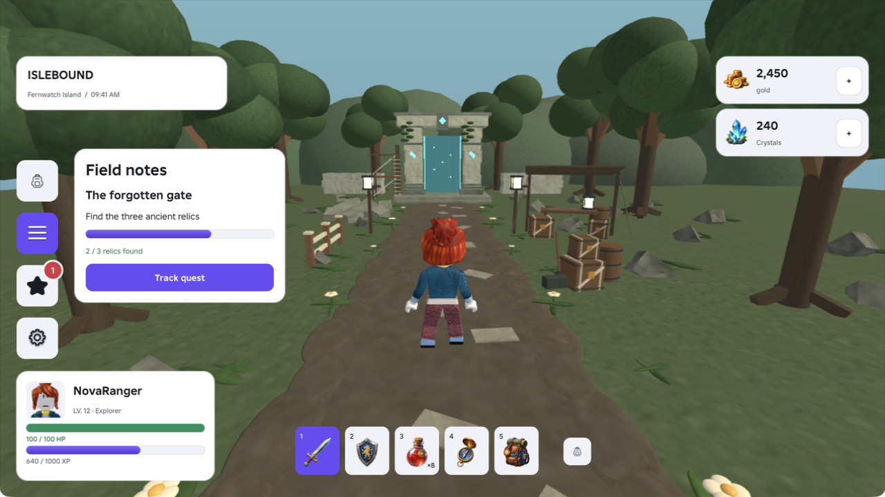
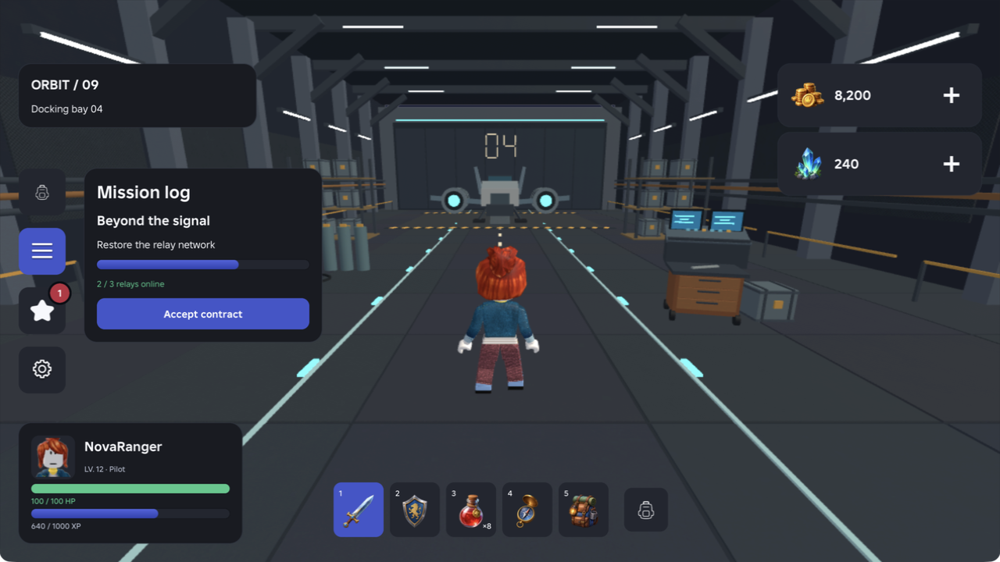
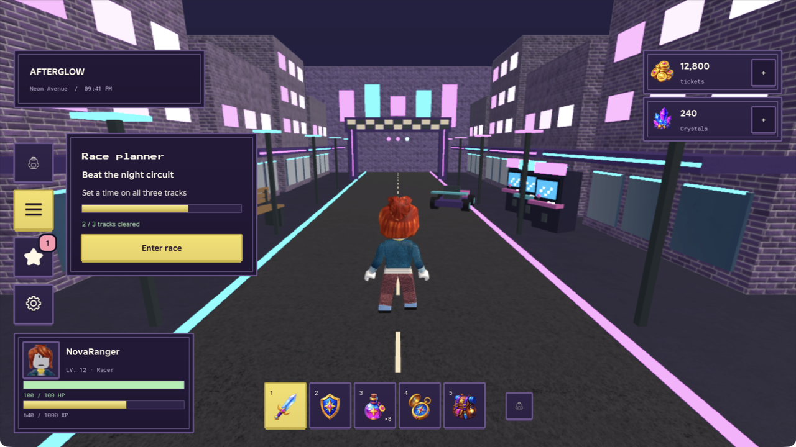
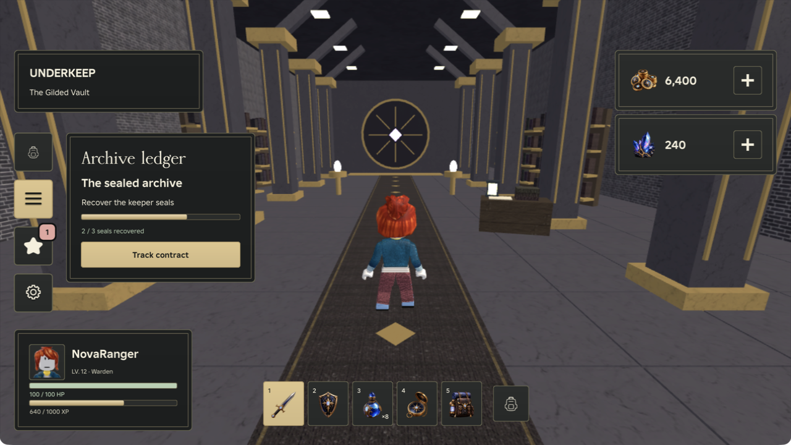
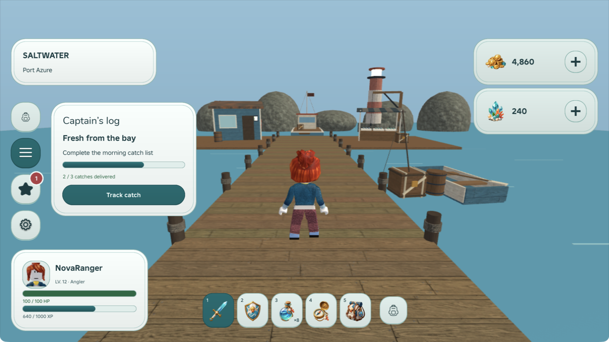
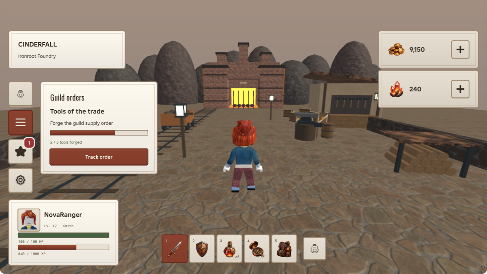
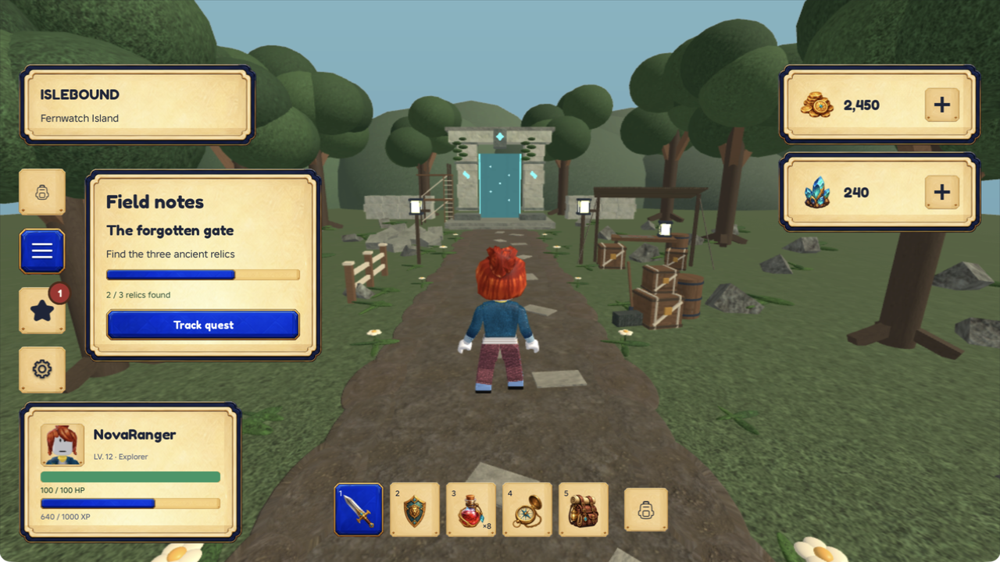
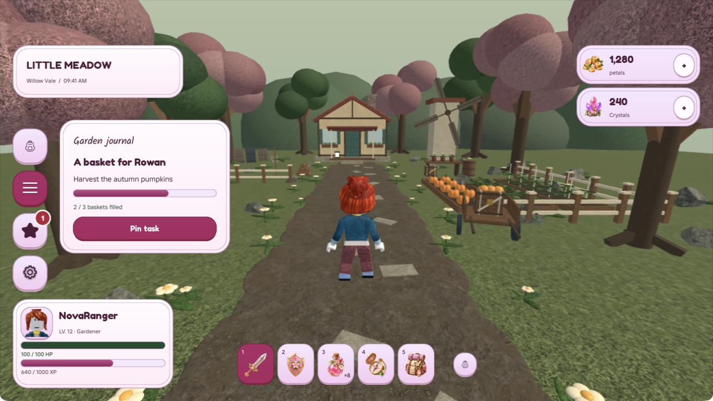
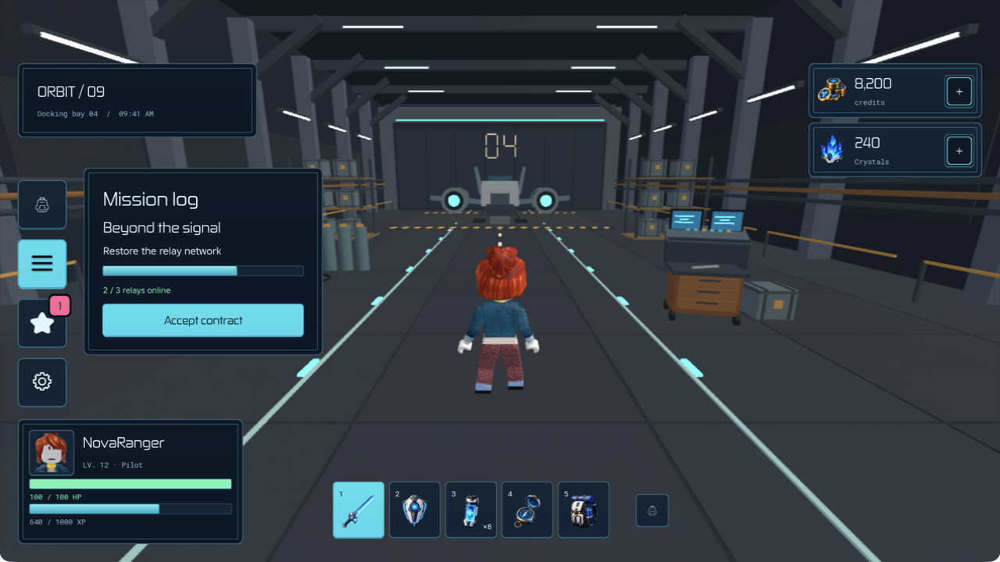
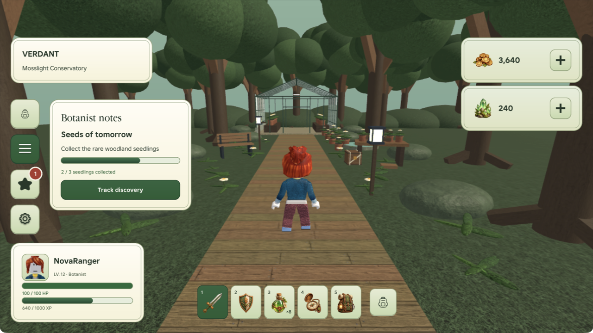

# oof/ui

**Roblox controls, styled as a system.**

Twenty React-Luau components built on native Roblox instances: buttons, dialogs,
progress bars, text fields, switches and more. Every component shares one theme,
so you can restyle your whole game UI by changing a few tokens. Mouse, touch and
gamepad input all work, and the source is copied into your project for you to
edit. Core is free under MIT.



| Default · free | Light · free |
| --- | --- |
|  |  |

## Quick start

**1. Install the CLI** (it also installs Rojo and Wally if you're missing them;
Node isn't needed):

```sh
# macOS / Linux
curl -fsSL https://oofui.bytespell.com/install.sh | sh
```

```powershell
# Windows PowerShell
irm https://oofui.bytespell.com/install.ps1 | iex
```

**2. Create a game and open it:**

```sh
mkdir my-game && cd my-game
oofui init          # Rojo game + starter HUD + Button, Container, ProgressBar, Text
oofui build
oofui studio open   # then press Play
```

The starter HUD is in `src/client/init.client.luau`. It has a progress bar, a
button that adds XP, and a theme switcher. Edit that file to start building.

**3. Iterate with live sync** (optional). Run `oofui dev`, then click
**Connect** in the Rojo Studio plugin. Your edits sync into Studio as you save.

Already have a Rojo game? Run `oofui init` in it. It merges into your existing
`default.project.json` and `wally.toml` and leaves your scripts alone.

### No Rojo? Use the drop-in model

1. Download `oofui-standalone-0.1.0.rbxm` from the
   [latest release](https://github.com/bytespell-org/oofui/releases/tag/v0.1.0).
2. Drag it into `ReplicatedStorage` in Studio (or use **Insert from File**).
3. In a LocalScript in `StarterPlayerScripts`:

```luau
local Ui = require(game:GetService("ReplicatedStorage").OofUi)
local e = Ui.React.createElement -- React is bundled with the model

Ui.mount(e(Ui.Button, { text = "Hello", onActivated = function() print("hi") end }))
```

The model includes every free component plus React 17.2.1, so there's nothing
else to install.

### Using Wally

```toml
[dependencies]
OofUi = "bytespell/oof-ui-primitives@0.1.0"
```

Then `require(ReplicatedStorage.Packages.OofUi)`. React and ReactRoblox are
installed with it.

## Using components

```luau
local ReplicatedStorage = game:GetService("ReplicatedStorage")
local React = require(ReplicatedStorage.Packages.React)
local Ui = require(ReplicatedStorage.OofUi)
local e = React.createElement

local ui = Ui.mount(
	e(Ui.Button, {
		text = "Continue",
		onActivated = function()
			print("Ready to play")
		end,
	}),
	{ theme = "light" }
)
```

`Ui.mount` creates the ScreenGui (with sibling layering and safe-area insets set
up correctly), the theme, the style sheet and the React root. It returns a handle:

```luau
ui:render(e(App, { coins = 120 }))  -- re-render with new props
ui:setTheme("default", {           -- switch themes; component state is kept
	CnColorAccent = Color3.fromRGB(84, 116, 255),
})
ui:unmount()                        -- destroys everything it created
```

`Ui.React` and `Ui.ReactRoblox` are the React copies the library uses. Mounting
by hand still works if you'd rather manage your own ScreenGui. See
[the composition guide](skills/oofui/references/composition.md).

### Finding what you need

```sh
oofui list                 # every component and theme, with a one-line summary
oofui docs dialog          # props (with allowed values) and a copy-paste example
oofui add dialog switch    # install; dependencies come along automatically
```

Typos get suggestions (`oofui add swich` → *Did you mean switch?*). Every
command accepts `--json`. `--dry-run` previews writes, and files you've edited
are never overwritten unless you pass `--overwrite`.

## The components

| Component | What it's for |
| --- | --- |
| Button, IconButton | Actions with variants, sizes, icons, loading state and badge counts |
| HoldButton | Press-and-hold confirmation for risky actions (sell, delete, prestige) |
| Container | Themed panel that auto-sizes and stacks its children |
| Text | Display, heading, body, subtext and caption styles with semantic tones |
| ProgressBar, RadialProgress | XP, health, loading, cooldowns and timers |
| Dialog | Modal with footer actions; dismissable with the backdrop, Escape or gamepad B |
| TextField | Single- or multi-line input with invalid and read-only states |
| Checkbox, Switch, RadioGroup | Settings and choices, controlled or uncontrolled |
| Field, FieldLabel, FieldDescription, FieldError, FieldContent, FieldGroup | Labeled form rows and settings pages |
| Separator | Dividers |

Button, IconButton and HoldButton accept `badge = true` for an unread dot or
`badge = 12` for a count. Zero clears it. Counts cap at `99+`, and `badgeMax`
changes the limit.

## Theming

Themes are sets of tokens: colors, typography, spacing and materials. Start
from a theme and override only what you need:

```luau
Ui.mount(e(App), {
	theme = "default",
	overrides = { CnColorAccent = Color3.fromRGB(255, 140, 60) },
})
```

Unknown theme ids or token names fail with a message that lists the valid
choices.

## Build with your agent

`oofui init` installs a project skill at `.agents/skills/oofui`. It teaches
coding agents how to find components, read their props, and compose and verify
UI in Studio. Try asking: *"Use $oofui to add a settings dialog with music and
SFX switches."* [Agent guide](https://oofui.bytespell.com/#/docs/agents).

## Explore the example game

To see every component in a small, deterministic example world, clone this
repository and run:

```sh
rokit install
wally install
rojo build showcase.project.json -o build/showcase.rbxlx
```

Open the place in Studio and press Play. A theme selector pairs Default with an
outpost and Light with an island. Pin a quest, claim a daily reward, and toggle
a setting; theme and world changes keep control state. The example has no game
backend.

## The Pro collection

| Arcade · Pro | Obsidian · Pro |
| --- | --- |
|  |  |

| Tide · Pro | Ember · Pro |
| --- | --- |
|  |  |

Adventure, Bloom, Circuit, Grove, Arcade, Obsidian, Tide and Ember are sold
separately as one editable theme pack. They use the same components and theme
contract, so switching is a single `setTheme` call. Pro Plus adds complete game
kits: Inventory, Quest Log, Season Pass, Daily Rewards, Item Shop, Crafting,
Collection, Upgrades, Inventory Bar, Player Card and Currency View. The
collection is being prepared for sale; none of its source is in this repository.

| Adventure | Bloom |
| --- | --- |
|  |  |

| Circuit | Grove |
| --- | --- |
|  |  |

## Platform notes

The CLI supports Windows x64, macOS (Apple silicon and Intel) and Linux x64
with glibc. Roblox Studio itself needs Windows or macOS. Wally needs Rosetta on
Apple silicon, and Linux needs `curl` and `unzip`. After installing on
macOS/Linux, open a new terminal. Rerun the installer to update. Run
`oofui doctor` any time to check your tools. To run the CLI from source
(Node 22.12+), use `npm install -g ./cli`.

## Contributing to Core and the CLI

Edit native implementations in `src/`, then run `npm test`. Its pretest
refreshes the CLI's free registry from the approved Wally source list. For a new
component or dependency, update the item metadata and bundle file list in
`cli/registry`. `npm run build:registry` refreshes source hashes without
fetching paid content. CI uses the pinned Rokit tools and checks the actual
installed Rojo tree.

Core source is [MIT licensed](LICENSE). Pro preview images illustrate the
separately licensed theme collection; this repository does not grant its source.
